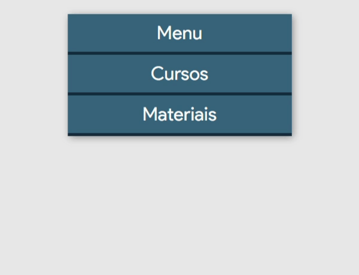

    <!-- Top Image and Title -->
	<h1>
		  
		Menu Accordion
	</h1>
    <!-- Subtitle/Description -->
	<h4>Menu accordion style with animations</h4>
	

    <!-- Image Shields -->
	
	
	
	 

<!-- Nav Menu -->
<a href=#telescope-tecnologias>Technologies</a>&nbsp&nbsp|&nbsp&nbsp<a href="#pen-créditos">Credits</a>&nbsp&nbsp|&nbsp&nbsp<a href="#memo-licença">License</a>  

<!-- Gif/Image of Example -->

### :telescope: Technologies

- [HTML5](https://developer.mozilla.org/pt-BR/docs/Web/HTML)
- [CSS3](https://developer.mozilla.org/pt-BR/docs/Web/CSS)

---

### :memo: License
  
- :balance_scale: MIT License - [About](https://github.com/joaovictornsv/menu-accordion-html-css/blob/master/LICENSE)
